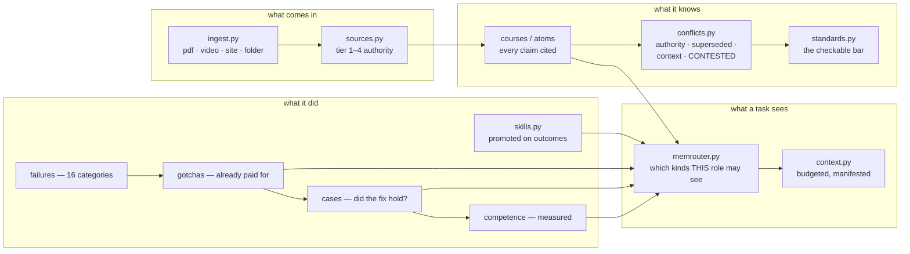

# Expert Fleet — the complete technical account

**What this is.** A file-backed, stdlib-only platform for building expert AI
agents that work continuously, prove what they did, and remember what they
learned. 119 Python modules, 155 acceptance tests, one HTML control panel, no
database, no framework, no build step. Python 3.11+ and your own API keys.

**Who this document is for.** Somebody who has just been handed the
repository and wants to know: what is the idea, how does it work, and why
should any of it be believed. It does not assume you have read the code, and
it does not ask you to take anything on faith — every claim below names the
mechanism that enforces it and the test that would fail if it stopped
working.

**A standing caveat, repeated throughout because it is the most important
thing on this page.** Every model call in every test runs against a scripted
mock or a loopback server that speaks the provider protocol. A green test
suite proves the *harness* holds. It has never proved that any real provider
behaves well. `python loop.py check` is the only live probe, and until
somebody runs it with a real key, the honest ceiling for every capability
here is **OFFLINE VERIFIED** — which is exactly what `python proof.py`
reports.

---

## Table of contents

1. [The problem this exists to solve](#1-the-problem-this-exists-to-solve)
2. [The central thesis](#2-the-central-thesis)
3. [The eleven concepts](#3-the-eleven-concepts)
4. [Architecture: how a task actually runs](#4-architecture-how-a-task-actually-runs)
5. [The six authorities](#5-the-six-authorities)
6. [The memory institution](#6-the-memory-institution)
7. [Learning: from material to measured competence](#7-learning-from-material-to-measured-competence)
8. [The proof system](#8-the-proof-system)
9. [The interface](#9-the-interface)
10. [Why I claim it works](#10-why-i-claim-it-works)
11. [What is NOT proven](#11-what-is-not-proven)
12. [Every module, and what it is for](#12-every-module-and-what-it-is-for)
13. [Getting started](#13-getting-started)

---

## 1. The problem this exists to solve

An LLM with a shell is not an employee. It is a very fast contractor with no
memory, no accountability, and a sincere willingness to tell you a job is
finished when it is not.

Five specific failures follow from that, and each one is a design constraint
rather than a bug to be patched:

**It says done when it is not.** The single most expensive failure mode in
agentic systems. A model that has written a file, or believes it has, will
report success. Nothing in the model can fix this, because the model is the
thing being asked.

**It forgets.** Every session starts from nothing. Yesterday's failure is
tomorrow's failure. The expensive lesson is paid for repeatedly.

**It drifts.** Over a long task, the objective quietly becomes whatever the
last few messages were about. The work continues; the goal is gone.

**It cannot be held to anything.** "Do a good job" is not a specification. If
nobody can say what finished means before the work starts, nobody can say it
afterwards either.

**Its capability is bounded by its interface, not its intelligence.** A model
that cannot read a PDF will describe the PDF it imagines. A model with no
memory of a failure will repeat it. A model with no tools can only produce
text about actions.

---

## 2. The central thesis

> **Capability comes from the system around the model, not from the model.**

This is not a slogan; it is the thing the entire architecture is arranged
around, and it is falsifiable. If it were false, adding memory, gates, tools
and an objective to a cheap model would not change its verified output — and
you could measure that.

The corollary that does the work:

> **A claim of completion, by anyone or anything, is worth nothing. Only
> evidence is worth something — and evidence is something a *different*
> mechanism produced.**

Every design decision in this repository descends from that sentence:

| Because... | ...therefore |
|---|---|
| the model cannot judge its own work | a **gate** is a command that must exit 0, run by the platform, not the model |
| a claim is not evidence | **proof levels** are derived from recorded observations, never set |
| the objective drifts inside a transcript | the **mission contract** lives on disk, outside the conversation, and is recompiled into every window |
| a lesson learned once must not be paid for twice | **failures, gotchas and cases** are ledgers the next task reads first |
| an instruction is not a boundary | **authorities** are code gateways; prompt text is never a security control |
| a status somebody can click green is a status nobody can trust | no endpoint in this platform accepts a proof level |

---

## 3. The eleven concepts

Everything else is implementation. These eleven are the ideas.

### 3.1 The Expert

An **expert** is a directory, not a chat. It owns its identity, its settings,
its task queue, its studied material, its skills, its failures, its logs, and
its own copy of the charters it wakes up with. Two experts share code and
share nothing else — an expert is portable, backupable, and legible with
`ls`.

```
experts/cardio-consultant/
  identity.md          who it is — injected into every context window
  settings.toml        which models, which budgets, which sandbox
  state.json           the hot task queue (finished work is archived out)
  prompts/             its own copy of the constitution and role charters
  courses/             what it studied, as cited atoms
  skills/              procedures it has proven it can perform
  memory/              failures, gotchas, competence
  missions/            objectives with success criteria and evidence
  logs/                every event, rotated at 5 MB × 5
  contexts/            the exact window every task was given
```

### 3.2 The Gate — "done" is a command, not an opinion

A task may carry a **definition of done**: a command that must exit 0 before
the agent is permitted to call the task finished.

```bash
python loop.py add --role practitioner \
  --goal "write the supplier review" \
  --done-check "python -c \"import os,sys;sys.exit(0 if os.path.exists('out/review.md') else 1)\""
```

When the model calls `finish_task`, the platform runs that command. If it
exits non-zero, the finish is **refused**, the failure text is handed back to
the model, and it tries again. The counter of refusals (`done_rejects`) is
kept, because it is the most honest reliability metric this platform has:
*how often did it claim completion and get caught?*

Gates come from a **closed catalogue** (`gates.py`) — `exists`, `designcheck`,
`citecheck`, `verify`, `memcheck`. The panel cannot accept a free-form shell
string as a definition of done, because a definition of done arriving over
HTTP from a browser is remote code execution wearing a helpful name.

### 3.3 The Mission Contract — an objective that survives everything

A **mission** is an objective plus success criteria, held on disk, outside
the transcript.

- The objective is **immutable**. Amending it is recorded, fingerprinted, and
  shown on the mission page — you cannot quietly edit the goal to match what
  was achieved.
- Every criterion is met by **evidence**, never by assertion.
  `mission.meet()` refuses an empty evidence string.
- Every action must **name the criterion it serves** (`mission.justify()`).
  An action that serves none is busy work, and busy work is how a long
  mission burns a budget while going nowhere.
- Evidence is **monotonic** — appended, never replaced.
- The contract is **recompiled into every context window**, so a compaction, a
  restart, or a model swap cannot erase the goal.

### 3.4 The Gap Router — failure is diagnosed, not just retried

When work stops, the reason determines what happens next. Six dimensions,
each routing somewhere different:

| Gap | Means | Routes to | The user sees |
|---|---|---|---|
| **knowledge** | it does not know something | research → sources → curriculum → study → exam | "Needs to learn" |
| **capability** | a tool or computer is missing | capability acquisition in a disposable worker | "Needs a tool" |
| **authority** | a permission or human decision is missing | **the owner** — trying harder cannot fix this | "Needs you" |
| **strategy** | the approach is wrong, not the execution | replan with the failure as evidence | "Needs a new plan" |
| **environment** | the world changed under the plan | re-observe, then replan | "Environment changed" |
| **execution** | the step was right, the attempt failed | retry with the error in hand | "Retrying" |

The distinction that matters most is **authority**. It is the only one a
machine must never attempt to solve on its own, and separating it from the
others is what makes "Needs you" a short list instead of a log.

### 3.5 The Five Authorities — one gateway per kind of power

The forensic audit of this codebase found one pattern over and over:

> *a control correctly defends the path its author was thinking about, and
> does not know about the other paths that reach the same operation.*

Six places executed shell; one was tested. Four subsystems resolved
credentials from hand-written lists that disagreed. The fix is not eighteen
patches — it is **five gateways every caller must pass through**:

| Authority | Module | Every caller must use it to… | Mandatory controls |
|---|---|---|---|
| **Execution** | `execution.py` | run any process | typed operation, role capability, policy screen, sandbox, scrubbed env, approval, trace, timeout |
| **File** | `fileauth.py` | touch any model-influenced path | canonicalise, contain, zone check, symlink safety, atomic write |
| **Credential** | `credentials.py` | resolve or exclude a secret | one inventory for runtime, backup, packaging, health and workers |
| **Model gateway** | `modelgateway.py` | make any provider call | budget, per-call attribution, cost, purpose, latency |
| **Effect** | `effects.py` | do anything with an outside consequence | intent record, idempotency key, outcome, reconciliation |

**These are enforced, not documented.** `python execution.py --audit` scans
every module in the tree for a raw `subprocess` call outside the authority
and reports violations; `tests/test_invariants.py` fails the suite if there
are any. Today: **0 violations across 77 modules**, with 16 modules declared
platform-internal, each carrying a written reason.

### 3.6 The Memory Institution — what outlives every model

Memory here is not a vector database. It is a set of **categories**, each
with its own lifecycle, because "remember things" is not a design:

- **Courses and atoms** — studied material, as claims that carry a citation
- **Skills** — procedures, promoted only on recorded outcomes
- **Failures** — sixteen categories, every one attributable to a task
- **Gotchas** — environment failures this expert already paid for, injected
  *before* the next attempt at anything that resembles them
- **Cases** — did the fix actually hold? The number that separates "we have
  failed 184 times" from "we know what works"
- **Competence** — measured per (expert, domain) from gated outcomes; a
  1-for-1 record is reported as weak, not as mastery
- **Commons** — what the whole fleet knows together
- **Premise awareness** — refuse to build on something already known false

A **memory router** (`memrouter.py`) decides which kinds each role may see.
The Student sees the course and nothing else, because a closed-book exam is
not closed-book if the answers are in the window.

### 3.7 The Source Ledger — not all claims are equal

Every ingested source is recorded with an **authority tier**: normative (a
spec), professional (documentation), instructional (a tutorial), anecdotal (a
forum post). When the material disagrees with itself, `conflicts.py` rules on
it:

- **authority** — a spec outranks a blog post
- **superseded** — 2026 beats 2018
- **context** — both hold, under different conditions
- **contested** — equals, no winner

A **contested** point may never be asserted as settled, and the citation gate
refuses any answer that tries. That is a real epistemic position implemented
as a mechanical check.

### 3.8 The Proof System — "finished" is derived, never claimed

Six levels, computed from evidence bound to a code hash:

| Level | Name | Means |
|---|---|---|
| 0 | SPEC | planned only |
| 1 | IMPLEMENTED | code exists; nothing has been proven |
| 2 | OFFLINE VERIFIED | controlled acceptance tests pass |
| 3 | LIVE VERIFIED | the real external dependency path works |
| 4 | STRESS VERIFIED | adversarial, failure and concurrency tests pass |
| 5 | PRODUCTION PROVEN | sustained real workload meets declared thresholds |

The properties that make this worth anything:

- **No level is stored.** Each is computed at read time from observations.
- **Evidence is bound to a code hash.** Change a file a capability covers and
  its badge drops on its own, with nobody deciding.
- **Live evidence expires.** 30 days for live, 90 for stress.
- **No endpoint accepts a level.** The panel can re-run evidence and nothing
  else. `tests/test_ux.py` enumerates the proof routes and fails if any of
  them takes a write other than `refresh`.

This system demonstrated itself repeatedly during development: editing seven
modules dropped seven capabilities from OFFLINE VERIFIED to IMPLEMENTED
automatically, and nothing but re-running the evidence could raise them.

### 3.9 Workers — where work runs, and why that one

An expert is permanent; the computer it runs on is not. `workers.py` models
computers with a **trust zone**, a cost, a start-up time, and a set of
capabilities:

| Kind | Zone | Implies |
|---|---|---|
| local-docker | isolated | docker, install |
| cloud-container | isolated | docker, install |
| cloud-vm | isolated | browser, gui, install, docker |
| gpu-worker | isolated | gpu, cuda, install |
| fleet-worker | org | internal-network |
| local-host | **trusted** | gui — *never chosen automatically* |

Placement is **cheapest → most isolated → fastest to start**. Isolation
outranks speed deliberately: an organisation machine on the internal network
is often free *and* instant, so a naive tie-break would quietly make it the
default home for arbitrary model-authored work.

And the choice explains itself in a sentence:

> *Using Office Windows PC because excel + internal-network are required (no
> compute cost)*

…with a disclosure naming why every other computer was passed over. A routing
decision nobody can disagree with is one nobody can correct.

### 3.10 Capability Acquisition — a ladder, not a switch

When an agent needs a tool it does not have:

```
requested → inspected → installed → tested → trusted
```

Each rung is earned by recorded evidence. Two refusals are structural:

- **An install never runs on the host or the control plane.** If no
  disposable worker exists, acquisition FAILS. It does not fall back to
  "well, just this once".
- **A capability test is mandatory.** A tool that installed cleanly has
  proven that it installs, which is not the same as proving it does the job.

Inspection blocks unpinned versions and typosquats (a name one edit away from
a very popular package), and flags manifests that read credentials or pipe
downloads into a shell.

### 3.11 The Training Lab — and where it stops

`training.py` exports verified trajectories, splits them deterministically,
registers candidate checkpoints and governs promotion. It refuses a candidate
evaluated with a *different verifier* (that comparison measures the verifier),
refuses a change below its declared threshold, refuses a single-seed result,
and requires every promotion to record a rollback target.

**It performs no gradient updates at all**, and says so on every export. That
needs a GPU and a trainer this platform does not carry, and pretending
otherwise would let it claim a proof level it has not been anywhere near.
The boundary is the feature.

---

## 4. Architecture: how a task actually runs

```mermaid
flowchart TD
    Q["task queued in state.json"] --> C{"claim_task<br/>under a cross-process lock"}
    C -->|"atomic queued→running"| PROC{"a PROVEN compiled procedure<br/>matches, and its typed inputs fit?"}
    C -->|"already claimed"| SKIP["another loop has it"]
    PROC -->|yes| DET["execute it deterministically —<br/>ZERO model calls; the task's own<br/>gate still decides acceptance"]
    PROC -->|"no, or the gate refused it"| CTX["context.compile()"]
    DET -->|gate passed| DONE2["done"]
    DET -->|gate refused| CTX

    CTX --> M1["per-source token budgets<br/>mission · self · gotchas · skills ·<br/>commons · course · premise"]
    M1 --> M2["manifest written beside the transcript:<br/>what was included, what was cut, why"]
    M2 --> ROUTE{"role on auto routing?"}
    ROUTE -->|yes| RT["modelrouter: cheapest model that<br/>cleared the bar on THIS expert's work"]
    ROUTE -->|no| ST["the configured model"]
    RT --> CALL
    ST --> CALL["MODEL GATEWAY<br/>budget · attribution · cost · purpose"]

    CALL --> TOOL{"tool call"}
    TOOL --> AT["allowed_tools(role)<br/>— the Rule of Two"]
    AT -->|denied| TERR["tool error, counted apart<br/>from model errors"]
    AT -->|allowed| EXEC{"which tool"}

    EXEC -->|read/write| FA["FILE AUTHORITY<br/>canonicalise · zone · contain"]
    EXEC -->|run_command| EA["EXECUTION AUTHORITY<br/>policy · sandbox · scrub · approve"]
    EXEC -->|finish_task| GATE{"done_check passes?"}

    GATE -->|"exit ≠ 0"| REFUSE["FINISH REFUSED<br/>done_rejects++<br/>failure text handed back"]
    REFUSE --> TOOL
    GATE -->|"exit 0"| DONE["done — evidence recorded"]
    GATE -->|"no gate"| CLAIM["done on the model's word<br/>(and the panel says so)"]

    DONE --> AFTER["failure/case ledgers · competence ·<br/>skill outcomes · model outcomes · trace"]

    style REFUSE fill:#3A1B14,stroke:#D97A66
    style DONE fill:#14301F,stroke:#5FB877
    style EA fill:#123335,stroke:#5FB8BE
    style FA fill:#123335,stroke:#5FB8BE
    style CALL fill:#123335,stroke:#5FB8BE
```



**The brakes**, all enforced between steps: a per-task cost ceiling, a daily
budget breaker, a step cap, a repetition detector (identical tool call warned
at 3, failed at 5), a declared stop condition (criteria, max attempts,
deadline, max steps), and retry-with-fresh-eyes on failure.

**The six tools**, and nothing else: `read_file`, `write_file`,
`run_command`, `subquery` (a disposable sub-model call over a file slice —
the material never enters the window), `finish_task`, `ask_human`. Each
role gets an allowlist — the
Student has no shell and no `read_file`, because its exam is closed-book;
no role that handles untrusted material holds `run_command`.

---

## 5. The six authorities

### Execution Authority

Every process this platform starts is a **typed operation**, and the type is
decided by *who wrote the string*:

| Operation | String written by | Shell? | Policy | Sandbox | Approval |
|---|---|---|---|---|---|
| `model_command` | the model | yes | ✅ | ✅ | on risk |
| `gate` | the model (a done-check) | yes | ✅ | ✅ | — |
| `capability_probe` | the model | yes | ✅ | ✅ | — (sandboxed) |
| `converter` | the platform | **no — argv only** | — | — | — |
| `platform_spawn` | the platform | **no — argv only** | — | — | — |

A platform-authored call takes an argument vector and can never invoke a
shell, because a platform call has no reason to. A model-authored call always
screens through `policy.py` and always runs in the configured sandbox.

`tests/test_invariants.py` enumerates every operation in the catalogue and
asserts each one enforces what it declares — then feeds each the *wrong*
command type and requires a refusal.

### File Authority

Four zones, and rights are asserted per zone rather than per file, so a
control file added tomorrow is covered the day it is created:

| Zone | Contents | Agent may write? |
|---|---|---|
| **workspace** | courses, out, skills, inbox | ✅ |
| **control** | settings.toml, prompts/, state.json, approvals/, variants/ | ❌ |
| **runtime** | logs/, contexts/, checkpoints/, events/ | ❌ |
| **secret** | agent.env, keys/, ui-token.txt | ❌ **read or write** |

Why control files are unwritable: writing `settings.toml` let a model point a
provider at an attacker's `base_url` and post the API key to it; writing
`prompts/` bypassed the charter promotion gate; writing `approvals/` forged
the owner's sign-off. Capability removal only works if the file listing the
capabilities is out of reach.

Containment is tested against **twelve escape spellings** — posix, Windows,
UNC, mixed separators, nested traversal, absolute paths, drive letters.

The "agent may write?" column above is about the agent's FILE TOOLS. It was
read as a claim about the platform, and it was not one: a role holding
`run_command` reached the same files by running a program. That gap is the
Control Plane Authority's, below.

### Control Plane Authority

The invariant "a worker cannot change what it is allowed to do" spans two
gateways, and belonged to neither. The File Authority is right about the
tool; `policy.py` is right about the string and says in its own docstring
that it cannot follow the program that string starts. Between them,
`run_command` wrote `settings.toml`, `prompts/` and `approvals/` on the
shipped default — measured through a real practitioner task — and switching
to docker did not help, because the container bind-mounted the whole expert
root read-write.

`controlplane.py` brackets every **model-authored** execution
(`model_command`, `gate`, `capability_probe` — a done-check is written by the
model as surely as a command is):

| Backend | What happens to a control-plane write |
|---|---|
| `docker` / hosted | **prevented** — each control path is bound read-only inside the container; the boundary is the kernel's |
| `host` (default) | **reverted** — the zone is sealed before and verified after; the command is reported `exit=3` whatever it returned, and the attempt is logged |

The sealed set is DERIVED from `fileauth`'s zone model rather than listed a
second time, so a control directory added there is sealed the same day;
`tests/test_invariants.py` asserts the derivation. `state.json` is the one
declared exception — reported, never reverted, because a sibling loop writes
it and reverting would destroy that loop's work; the loop's own
`commit_task` is what stops a task marking itself done.

### Credential Authority

One inventory, four sources — environment variable, `agent.env`, inline
`api_key`, `api_key_file` — asked by every subsystem that must exclude a
secret: the runtime, the backup, the packaging step, the health check and the
worker environment. Before this existed, those five had four different
hand-written lists, and they disagreed.

Credentials are **withheld from every model-written command by name and by
value**, including on the docker backend and including in requests to a
third-party sandbox service. `[agent] command_env_allow` is the only way
through, and it is the owner's decision.

### Model Gateway

Every provider call — including compaction, replay, benchmark and probe —
records purpose, role, provider, model, tokens, cost and latency. Before this
existed, `run_task_step` recorded spend and the compaction summariser did
not, so the daily breaker under-counted worst on exactly the longest tasks.

### Effect Authority

An external side effect records **intent** before it happens, carries an
**idempotency key**, and records its **outcome or uncertainty** afterwards.
The docs no longer claim exactly-once, because exactly-once is not achievable
without remote idempotency and claiming it would be a lie.

---

## 6. The memory institution



Two properties worth naming:

**The context window is a compiled view, not a pile.** Every source has a
token budget. Over-budget files are trimmed with a pointer to read the rest.
A manifest is written beside every transcript recording what was included,
what was cut and why. Measured over 42 windows in the endurance soak, window
size is **flat at 1083 tokens** while fleet history grows — the window is
bounded by its budget, not by how much the fleet remembers.

**The student is closed-book by mechanism, not by instruction.** The memory
router excludes course material from the Student role, *and* the role's tool
allowlist excludes `read_file`. Two independent layers, because one of them
is configuration and configuration can be edited.

---

## 7. Learning: from material to measured competence

```
material → ripper → sources (tier) → curriculum (order) → study (cited atoms)
   → standards (the bar) → practice (gated tasks) → examiner
   → gaps → re-study → closed-book exam → competence
```

**Curriculum** (`curriculum.py`) orders material by **authority first** —
tier 1–2 before tier 3–4, so later material is read against an established
baseline instead of averaging into it — then by prerequisite direction and
relevance to the expert's own mission. Near-duplicates across sources are
marked `skim` rather than studied twice.

**The certification record** is what the panel shows, in place of a progress
spinner:

```
Sources    4 sources · 2 × tier1 · 1 contested point unresolved
Coverage   41/42 requirements have evidence · still open: R-017
Gaps       1 open — nothing yet covers termination for convenience
Exercises  12/12 lessons written up · 87 verified atoms
Exam       88% pass · closed book · 2 sittings · last 2026-08-21
Competence 34/41 gated tasks passed · medium confidence
```

**The API returns no percentages.** It returns numerators and denominators,
so the page *physically cannot* print "100% learned". `42/42 requirements
covered, exam 92%, 3 unresolved conflicts` is a sentence somebody can check;
a percentage is not.

---

## 8. The proof system

15 capabilities, each declaring: what a user can do with it, the invariants
that must hold, the files it covers, the tests that verify it, and what
raising its level would require.

```bash
$ python proof.py
PROOF CENTER — 15 capabilities

  2 OFFLINE VERIFIED             capability-acquisition
  2 OFFLINE VERIFIED             control-plane
  2 OFFLINE VERIFIED             credential-authority
  ...
  15 x OFFLINE VERIFIED

No level is stored anywhere. Each is computed from evidence that is bound to
the current code hash and expires with age.
```

Clicking a badge in the panel opens *why we believe this works*, the
invariants, the code hash the evidence is bound to, and the exact command
that reproduces it.

---

## 9. The interface

Six sections, named for **jobs rather than architecture**:

| Section | Purpose |
|---|---|
| **Home** | start work and see what needs attention |
| **Work** | everything being done |
| **Agents** | create and manage intelligence |
| **Resources** | what agents know and can use |
| **Proof** | evidence and quality |
| **Admin** | infrastructure and policy |

Design rules that are asserted by tests rather than aspired to:

- **Status always combines state and reason.** "Blocked — needs GitHub
  approval", never just "Blocked".
- **Colour never carries status alone.** Every coloured pill also has text.
- **One `<h1>` per page.** A view hosted inside another suppresses its own
  page title.
- **Every table sits in a scroll container** — 37 of them, checked — so a
  long cell scrolls the table and not the page.
- **Failures name which part failed** — the verifier, the platform, the
  provider, the budget breaker, the command, the agent, or you — plus what
  happens next and what you can do. The raw trace lives under Advanced.
- **⌘K opens a palette** where every action shows its equivalent CLI command,
  so the panel teaches the terminal instead of hiding it.

Creating an agent asks **five intent questions** and maps them invisibly onto
the five creation lanes; the lane is named once, at the end, as a footnote.

---

## 10. Why I claim it works

This is the section the rest of the document exists to earn. Five kinds of
evidence, in increasing order of how much they should convince you — and the
last one is the only one produced on a computer this project does not own.

### 10.1 The suite passes — the weakest claim

155 acceptance tests, green on Windows and Linux under
Python 3.11 and 3.13. Each test prints a sentence describing what it
observed, and those sentences are the report — `EVIDENCE.md` quotes them
verbatim rather than summarising.

This is the weakest claim because **a passing test proves nothing on its
own** — a point §10.5 makes concrete, where a suite that had been green twice
consecutively turned out to be hiding six defects. Which leads to:

### 10.2 The tests enumerate rather than exemplify

The audit's central finding was that a control defends the path its author
was thinking about. A test that calls `run_command` with a traversal string
proves that `run_command` refuses traversal — and says nothing about the five
other places that execute shell.

So `tests/test_invariants.py` does not test behaviour through an example. It
walks the tree:

| Check | Enumerates |
|---|---|
| execution paths | every subprocess call site in 77 modules |
| execution catalogue | every declared operation against what it declares |
| filesystem zones | every declared control file and directory |
| traversal spellings | 12 escape forms |
| credential sources | all 4, asked of every subsystem that must exclude them |
| metering purposes | all 9 provider-call purposes |
| role capabilities | all 9 roles against what their job needs |
| gate catalogue | every entry, and that a raw shell string never builds one |
| expert birth | every module that mints an expert |
| exam readers | every reader of `exam-results.md`, in every recorded format |
| sandbox names | all 139, across 99 test files, parsed with `ast` |
| documented CLI | all 61 subcommands `MANUAL.md` promises |

### 10.3 Mutation testing — break it and confirm the test notices

The question that decides whether a test is worth anything: **would it fail
if the feature were removed?**

`mutate_check.py` deliberately breaks each load-bearing behaviour and
requires the test that claims to cover it to fail:

| Mutation | Test that must catch it |
|---|---|
| docker egress allowed by default | `test_docker_live.py` |
| docker timeout leaves the container running | `test_docker_live.py` |
| the environment scrub removed from every backend | `test_secrets.py` |
| no Authorization header on provider calls | `test_live_provider.py` |
| a malformed body escapes the retry ladder | `test_live_provider.py` |
| a 4xx retried like weather | `test_live_provider.py` |
| the packaging step ships `agent.env` | `test_package.py` |
| finished work is never archived | `test_endurance.py` |
| every write allowed regardless of role | `test_rbac.py` |
| expert creation stops seeding the home | `test_invariants.py` |
| a running task is stolen from a live sibling loop | `test_audit.py` |
| a zero settle window can still hold a file back | `test_url.py` |
| a secret written under the umask † | `test_preflight.py` |
| the container runs as root in the mount † | `test_docker_live.py` |
| every host variable forwarded into the container ‡ | `test_docker_live.py` |

† POSIX-only: Windows uses ACLs rather than modes, so the property does not
apply there.

‡ POSIX-only for a different reason, and the one worth reading. Forwarding a
Windows `PATH` into a Linux container stops `sh` from being found, so the
container never boots and no assertion is reached. This row reported CAUGHT
on Windows for four releases while the credential checks it claimed to
certify had never executed; the first Linux run reported MISSED, which was
correct. Each skip now carries its own reason rather than a shared one — see
U21.

Every mutation is reverted afterwards. A `MISSED` row is a test that measures
nothing, and would be treated as a defect in the test.

### 10.4 The paths that touch something real

The strongest evidence, because it is not a test of a test:

**Docker containers actually start.** `test_docker_live.py` proves isolation
with a fact that holds on any host — the container answers under its own
hostname, never this machine's — plus a Debian `os-release` from the image.
(The os-release *alone* used to be the proof, which is a proof on a Windows
laptop and no proof at all on a Debian host, where the host would answer the
same way. CI on Ubuntu is what exposed that.) It confirms the mount works in
both directions and that the agent can then **rewrite and delete** what the
container produced — reading it back was never the property that mattered,
and on Linux the container ran as root until CI said so. It confirms that the
host's home directory and the platform's own source are invisible from
inside, that egress is refused by default (both on the argv *and* by a real
connection attempt failing), that credentials are withheld, that the
`--pids-limit` **bites** when the container tries to exceed it, and that a
gated task completes end to end inside containers.

**The provider HTTP client is driven against a server that answers.**
`tests/fake_provider.py` speaks the OpenAI-compatible contract and can be told
to misbehave. That exercises the ~90 lines that previously first ran when
somebody spent money: payload construction, the auth header, `extra_headers`,
usage-based cost (1M in at $3 + 1M out at $15 charged exactly $18.00), the
429/5xx backoff ladder with growing delays, the non-retryable break on 4xx
(exactly 1 call, not 5 paid ones), instant failover on a refused connection,
a 2-second timeout actually cutting off a 20-second hang, malformed bodies,
and the inline-JSON path for providers without function calling.

**The first day is rehearsed.** `test_first_day.py` runs the exact sequence a
new operator runs: bootstrap from an empty directory → `loop.py check` →
first gated task. It confirms the key bootstrap writes is the key that
reaches the wire, that a rejected key reports FAIL with the status and exits
non-zero, that a missing key names the exact variable, that a typo'd
`base_url` fails in 2.4 s rather than hanging, that the probe costs 16 output
tokens and caches by provider/model pair (9 roles → **1** request), and that
the key appears in no output and no log.

**Endurance is measured, not assumed.** 120 real tasks through 6 loop
restarts: per-task latency flat at 0.13 s across all six batches, the hot
queue held at its retention bound with 78 tasks archived and **none lost**,
logs capped at 29 MB, no lock outliving its holder, ~11 KB per task, context
window flat at 1083 tokens.

### 10.5 Computers we do not own — the strongest evidence here

Everything above was produced on one machine. That is the flaw in all of it,
and it is not a rhetorical concession — it is measurable, and it was measured.

The suite was green on a single Windows laptop, twice consecutively, after
four audit passes. Then GitHub Actions ran the identical suite on Ubuntu and
Windows across Python 3.11, 3.12 and 3.13. **Four of the six jobs failed**,
and every failure was a real defect that had been present the whole time:

- a task could be taken from a **live** sibling loop and executed twice —
  six tasks queued, fourteen completions logged, and a phantom retry of work
  that had succeeded;
- the docker sandbox ran as root and handed back a workspace the agent could
  not write to, in the backend the manual recommends for untrusted work;
- a secret was created world-readable, caught by the platform's own preflight
  running its POSIX branch for the first time ever;
- an evidence sentence claimed "on a Windows host" wherever it ran.

Reproducing each locally in a Linux container — so the diagnosis came from a
debugger rather than a log — surfaced two more that CI itself had passed by
luck: staleness decided by comparing two files' timestamps, which overlayfs
makes unsound. On that filesystem, 200 files written back to back produced
**nine** distinct timestamps.

The reason this is the strongest section is not that the defects were fixed.
It is that **no amount of care on one machine would have found them**, and
the project's own honest-limits list had been saying so, in writing, without
anyone being able to act on it. The gap between "we disclosed the limit" and
"we removed it" is six defects wide.

What now holds the class closed rather than the instances: an AST invariant
that parses every module and fails the build if any comparison puts a file
timestamp on both sides. Run against the previous release it names
`commons.py:284` and `conflicts.py:322`, and nothing else.

### 10.6 The audit record

`GAPS_RISKS_AND_UNFINISHED.md` contains **five passes**: two read-only
forensic audits, one that came from building a specification against the
running system, one that came from making the never-executed paths runnable,
and one that came from running the whole thing on hardware this project does
not own. Twenty-one numbered defects (`U1`–`U21`), each with reproduction,
disposition and the test that holds it closed.

**Five of them are defects in code written during those same passes.** They
are in the record because a report that finds faults only in other people's
work is not an audit.

---

## 11. What is NOT proven

Stated plainly, because a document that only reports wins is marketing.

| Not established | Why |
|---|---|
| **Any real provider's behaviour** | Every model call in every test is a mock or a loopback server. Prompt effectiveness, real token costs, real rate limits and genuine cross-provider failover are unmeasured. `python loop.py check` is the only live probe |
| **That the UI is usable** | The redesign spec asks for a five-person formative test at ≥90 % task completion. That has not happened and cannot be simulated. What the tests prove is that each flow's information is *reachable*, not that a stranger finds it |
| **Accessibility** | Keyboard reachability, focus order, labels and 40 px targets are in place and asserted. Contrast ratios and screen-reader behaviour have not been checked with a tool |
| **E2B / Daytona** | The REST client is verified against the documented shape. Neither service has ever received a request from this codebase |
| **A third-party MCP server** | The transport is real — a spawned subprocess speaking newline-delimited JSON-RPC — but the server on the other end is ours |
| **Duration** | The soak rules out growth that is O(total work). It cannot rule out a leak that needs days |
| **Docker beyond two operating systems** | Ubuntu and Windows now, still one image and one daemon version. The Linux run is what revealed that the container had been running as root and handing back a workspace the agent could not write to |
| **Any machine this has not run on** | This is no longer a theoretical caveat, it is a measured one. The suite was green on one Windows laptop, twice consecutively. The first CI run on Ubuntu and Windows × Python 3.11/3.12/3.13 **failed four of six jobs**, and every failure was a genuine defect — including a task being executed twice by two loops. Reproducing them in a local Linux container found two more. Six defects (U15–U20) were sitting in a codebase that had been audited four times and was passing everything it knew how to ask itself. The suite is green on both platforms now; that is a statement about two platforms |
| **The "100×" claim** | Defined as verified output per dollar *versus the same raw model without the fleet*. That needs the same work run twice; the baseline half has never been run. `metrics.py` reports the harness's observable contribution as counts and refuses to divide them into a multiplier |
| **Authentication** | Members hold personal bearer tokens and every write is checked against the role behind the credential — but over plain HTTP, with no TLS, no session and no expiry. This is authorisation given an identity, not an authentication system |
| **Beauty** | The design gate catches mechanical failures and the fingerprints of unconsidered output. A page can pass every check and still be dull |

**Release gates.** Of the six the engineering manual defines, only the first
is cleared:

| Release | Status |
|---|---|
| Developer build | ✅ **CLEARED** — 99 tests twice, harness check exit 0, working tree explained |
| Local owner beta | ❌ P0/P1 fixed and backup/restore tested, but **no real provider has ever been called** |
| Private cloud beta | ❌ RBAC and audit-by-user exist; authentication is a bearer token over plain HTTP, no secret manager, state is files |
| Organization pilot | ❌ none of tenant isolation, edge-worker policy, SLO telemetry or 24/7 endurance |
| Training Lab beta | ⚠️ verifier boundary, held-out split, registry and rollback are built and tested; no reward-hacking suite, and no gradient updates at all |
| Production autonomous specialist | ❌ no domain benchmark has been run against a baseline |

---

## 12. Every module, and what it is for

**The engine** — `loop.py` `harness.py` `context.py` `policy.py` `sandbox.py`
`effects.py` `locks.py` `checkpoint.py` `confidence.py` `candidates.py`

**The authorities** — `execution.py` `fileauth.py` `credentials.py`
`modelgateway.py` `gates.py`

**Creating agents** — `fleet.py` `quick.py` `templates.py` `team.py`

**Work systems** — `goal.py` `mission.py` `workflows.py` `consult.py`
`prospective.py` `routines.py` `research.py`

**The goal system's spine** — `contract.py` (acceptance frozen before
planning, sealed outside the expert's root) `runbook.py` (typed do+verify
procedures, earned trust, the model-free reconcile loop) `repair.py`
(signal-grounded self-repair under four laws) `swarm.py` (evidence-gated
multiplication, central graders) `universal.py` (readiness assessment)
`grants.py` (scoped expiring authority) `capability.py` (sealed capability
packs — the exam the student cannot touch) `mastery.py` (pretest → study →
practice → sealed exam → diagnose → verdict → distill → retest)

**Memory** — `memory.py` `skills.py` `commons.py` `recall.py` `gotchas.py`
`premise.py` `memrouter.py` `cases.py` `selfmodel.py` `twin.py` `twinmath.py` `twincapture.py` `twinaugment.py`

**Knowing what it knows** — `sources.py` `conflicts.py` `standards.py`
`curriculum.py` `ingest.py` `verify.py` `memcheck.py` `citecheck.py`
`designcheck.py` `discover.py` `knowledge.py` `experience.py`

**Governance** — `variants.py` `approvals.py` `replay.py` `benchmark.py`
`modelrouter.py` `org.py` `training.py` `proof.py` `evidence.py` `metrics.py`
`evalsuite.py` `mutate_check.py`

**Infrastructure** — `workers.py` `acquire.py` `toolbox.py` `providers.py`
`mcp.py` `federation.py` `trace.py` `backup.py` `package.py` `preflight.py`
`doctor.py` `bootstrap.py` `demo.py`

**Control plane** — `ui.py` `ui.html` `chief.py` `uicards.py`

**Procedural learning** — `procedure.py` (judged trajectory capture,
cross-trajectory induction, sealed evaluation) `operators.py` (typed
predicates, binding, composition search) `capability_graph.py` (the joined
view of what an expert can actually do) `runbook.py` (trust and deterministic
execution) `scheduler.py` (contextual expected-utility routing, shadow by
default) `verification.py` (the layered verifier, L0 supreme)
`calibration.py` (reliability curves; no production caller yet, and it says
so) `retrieval.py` (hybrid recall) `evaluation_policy.py` (module ablation)
`memory_policy.py` `memory_benchmarks.py` `adaptation.py`
`trainer_integration.py` `learning_authority.py` (sealed learning records)
`evaluation_workspace.py` `evaluation_corpus.py` `discovery_web.py`
`research_plan.py`

### Work that has been done before does not get done again

The branch at the top of that chart is the economic claim of the whole
platform. When a family of work has been done and independently judged more
than once, `procedure.py` induces an executable procedure from those
trajectories — separating what stayed constant from what varied, inferring
the typed inputs, the preconditions and the effects — and that procedure
earns PROVEN only by passing an owner-sealed suite of instances it has never
seen. From then on a matching task runs it directly: no model call, and the
task's own gate still decides whether the result is acceptable, so a
procedure is never the judge of its own replay. `metrics.py` reports the
consequence as **Amortization**: earlier versus later model steps per
verified success, by family. The operator-facing walkthrough is
[MANUAL.md §11b](MANUAL.md).

Full detail for most is in [REFERENCE.md](REFERENCE.md), which covers every
module, setting, endpoint and event name it has caught up with — the
procedural-learning group above is documented in
[MANUAL.md §11b](MANUAL.md) and in each module's own docstring.

---

## 13. Getting started

```bash
python bootstrap.py
```

One idempotent command: creates `agent.env`, tells you exactly what is
missing (numbered, with the fix), creates your first expert, starts the
control panel and opens it. Exit 0 = ready, exit 2 = blocked with a numbered
list.

```bash
python bootstrap.py --key DEEPSEEK_API_KEY=sk-...   # the value is never printed
python loop.py check --root experts/<slug>          # the only live probe
python loop.py run --drain --root experts/<slug>    # work the queue
```

**Without any key at all:**

```bash
python demo.py            # the whole platform, keyless, in one run
python tests/run_all.py   # 155 acceptance tests
python proof.py           # what is proven, and to what level
python evidence.py        # why we believe it, and where belief runs out
python metrics.py         # is it working — and the numbers we refuse to invent
python preflight.py       # is this installation fit to run unattended
```

---

## Reading order for the rest of the documentation

| Document | What it is |
|---|---|
| [MANUAL.md](MANUAL.md) | the operator's guide — every command, every setting |
| [CLOUDFLARE.md](CLOUDFLARE.md) | Cloudflare compatibility study — what is verified, what is documented, and what was rejected |
| [REFERENCE.md](REFERENCE.md) | every system end to end, and an honest list of limits |
| [GAPS_RISKS_AND_UNFINISHED.md](GAPS_RISKS_AND_UNFINISHED.md) | the audit record — five passes, 21 numbered defects |
| [REMEDIATION.md](REMEDIATION.md) | what was done about each, and the residual risk |
| [ARCHITECTURE_DECISIONS.md](ARCHITECTURE_DECISIONS.md) | each decision, the alternative rejected, and the price paid |
| [SYSTEM_DIAGRAMS.md](SYSTEM_DIAGRAMS.md) | execution, memory, trust boundaries, and where the defects lived |
| [TRACEABILITY_MATRIX.md](TRACEABILITY_MATRIX.md) | capability → test → what it observed → **what it does not establish** |
| [EVIDENCE.md](EVIDENCE.md) | generated from an actual suite run, quoting each test verbatim |
| [FULL_BUILD_FORENSIC_REPORT.md](FULL_BUILD_FORENSIC_REPORT.md) | the forensic audit, with evidence labels on every claim |
| [CHANGELOG.md](CHANGELOG.md) | what shipped, and the defects each release found |

---

## Licence

GNU Affero General Public License v3.0 — see [LICENSE](LICENSE) and the
plain-language summary in [README.md](README.md#license). The operative
consequence for this codebase is §13: it ships a network-facing control
panel, so a modified version offered to others as a service must offer those
users its source.
